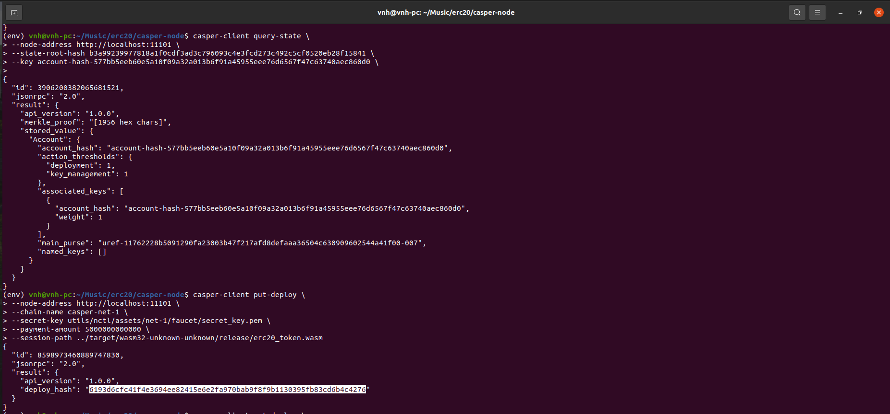

# Get Started With Casper

## 1.Create and deploy a simple, smart contract with cargo casper and cargo test

Install the dependencies, compiled and tested contract.


Deploy it on casper-test chain.


## 2.Complete one of the existing tutorials for writing smart contracts

Setup local node.


Get state root hash.


Deploy erc20 token on local node.



Query the status.


## 3.Demonstrate key management concepts by modifying the client in the Multi-Sig tutorial to address one of the additional scenarios.

I choose scenario 2: deploying with special keys

Script code:
```
const keyManager = require('./key-manager');

(async function () {
    // 1. Set mainAccount's weight to 2.
    // 2. Set Keys Management Threshold to 2.
    // 3. Set Deploy Threshold to 1.
    // 4. Add first new key with weight 1 (deploy key).

    let deploy;

    // 0. Initial state of the account.
    // There should be only one associated key (facuet) with weight 1.
    // Deployment Threshold should be set to 1.
    // Key Management Threshold should be set to 1.
    let masterKey = keyManager.randomMasterKey();
    let mainAccount = masterKey.deriveIndex(1);    // deployment and management
    let deployAccount = masterKey.deriveIndex(2);    // only for deployment

    console.log("\n0.1 Fund main account.\n");
    await keyManager.fundAccount(mainAccount);
    await keyManager.printAccount(mainAccount);
    
    console.log("\n[x]0.2 Install Keys Manager contract");
    deploy = keyManager.keys.buildContractInstallDeploy(mainAccount);
    await keyManager.sendDeploy(deploy, [mainAccount]);
    await keyManager.printAccount(mainAccount);

    // 1. Set mainAccount's weight to 2
    console.log("\n1. Set faucet's weight to 2\n");
    deploy = keyManager.keys.setKeyWeightDeploy(mainAccount, mainAccount, 2);
    await keyManager.sendDeploy(deploy, [mainAccount]);
    await keyManager.printAccount(mainAccount);
    
    // 2. Set Keys Management Threshold to 2.
    console.log("\n2. Set Keys Management Threshold to 2\n");
    deploy = keyManager.keys.setKeyManagementThresholdDeploy(mainAccount, 2);
    await keyManager.sendDeploy(deploy, [mainAccount]);
    await keyManager.printAccount(mainAccount);
    
    // 3. Set Deploy Threshold to 1.
    console.log("\n3. Set Deploy Threshold to 1.\n");
    deploy = keyManager.keys.setDeploymentThresholdDeploy(mainAccount, 1);
    await keyManager.sendDeploy(deploy, [mainAccount]);
    await keyManager.printAccount(mainAccount);
    
    // 4. Add first new key with weight 1 (first account).
    console.log("\n4. Add first new key with weight 1.\n");
    deploy = keyManager.keys.setKeyWeightDeploy(mainAccount, deployAccount, 1);
    await keyManager.sendDeploy(deploy, [mainAccount]);
    await keyManager.printAccount(mainAccount);
    
})();
```

Result: 


## 4.Learn to transfer tokens to an account on the Casper Testnet.


## 5.Learn to Delegate and Undelegate on the Casper Testnet.

Delegate: 


Undelegate:


